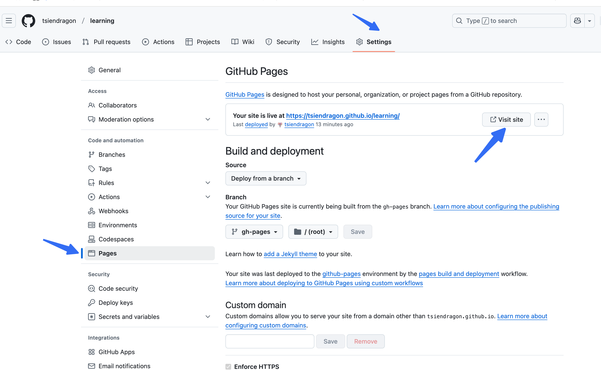

# Deploying a Static Site with MkDocs and GitHub Pages

## Prerequisites

- Python installed on your machine.
- A GitHub account with a repository for your project.

## Steps

1. **Install MkDocs**:

   ```bash
   pip install mkdocs
   pip install mkdocs-material
   pip install pymdown-extensions
   pip install mkdocs mkdocs-gitbook
   pip install mkdocs-minify-plugin
   pip install mkdocs-git-revision-date-localized-plugin

   ```

2. **Initialize MkDocs Project**:

   ```bash
   mkdocs new my-project
   cd my-project
   ```

3. **Organize Markdown Files**:
   - Place all markdown files in the `docs` directory.

4. **Configure Navigation**:
   - Edit `mkdocs.yml` to define the site's navigation.

5. **Build and Serve Locally**:

   ```bash
   mkdocs build
   mkdocs serve
   ```

6. **Deploy to GitHub Pages**:

   ```bash
   mkdocs gh-deploy
   ```
7. **github settup**

In the setting of the project, click page section, you will see visit pages
## Additional Tips

- Ensure your GitHub repository is set up to use GitHub Pages.
- Check the `gh-pages` branch for the deployed site content.
