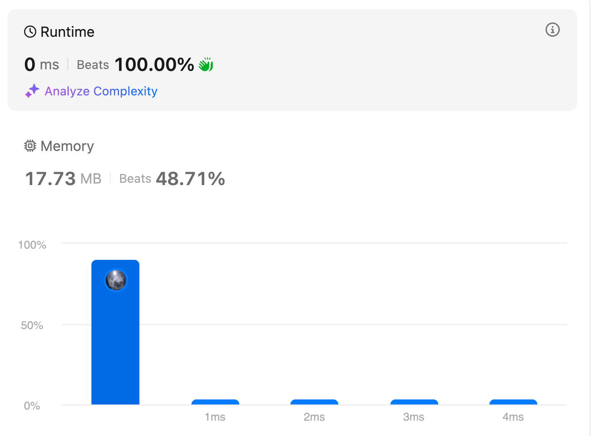

# Linked list Medium problems

## 19. Remove Nth Node From End of List

### Problem

<https://leetcode.com/problems/remove-nth-node-from-end-of-list/description/>

Given the head of a linked list, remove the nth node from the end of the list and return its head.
### Example


- Input: head = [1,2,3,4,5], n = 2
- Output: [1,2,3,5]

### Solution

```python3
class Solution:
    def removeNthFromEnd(self, head: Optional[ListNode], n: int) -> Optional[ListNode]:
        dummy = ListNode(0, head)
        first = second = dummy

        # Move first pointer n+1 steps ahead
        for _ in range(n + 1):
            first = first.next

        # Move both pointers until first reaches the end
        while first:
            first = first.next
            second = second.next

        # Remove the nth node from the end
        second.next = second.next.next

        return dummy.next
```



### Explanation

The `removeNthFromEnd` function is designed to remove the nth node from the end of a singly linked list. Here's a step-by-step explanation of how it works:

1. **Initialization**:
   - A dummy node is created and linked to the head of the list. This helps handle edge cases, such as when the list has only one node or when the head itself needs to be removed.
   - Two pointers, `first` and `second`, are initialized to point to the dummy node.

2. **Advance the `first` Pointer**:
   - The `first` pointer is moved `n + 1` steps forward. This ensures that the gap between the `first` and `second` pointers is `n` nodes apart.

3. **Move Both Pointers**:
   - Both `first` and `second` pointers are moved one step at a time until the `first` pointer reaches the end of the list. At this point, the `second` pointer will be pointing to the node just before the one that needs to be removed.

4. **Remove the Nth Node**:
   - The `second` pointer's `next` is adjusted to skip the nth node from the end, effectively removing it from the list.

5. **Return the New Head**:
   - The function returns `dummy.next`, which is the head of the modified list.

## 24. Swap Nodes in Pairs
<https://leetcode.com/problems/swap-nodes-in-pairs//>

### Problem Description

Given a linked list, swap every two adjacent nodes and return its head. You must solve the problem without modifying the values in the list's nodes (i.e., only nodes themselves may be changed.)

- Input: head = [1,2,3,4]

- Output: [2,1,4,3]

- Explanation:


### Solution

```python
class Solution:
    def swapPairs(self, head: Optional[ListNode]) -> Optional[ListNode]:
        dummy = ListNode(0)
        dummy.next = head
        prev, current = dummy, head

        while current and current.next:
            # Nodes to be swapped
            first = current
            second = current.next

            # Swapping
            prev.next = second
            first.next = second.next
            second.next = first

            # Re-position prev and current
            prev = first
            current = first.next

        return dummy.next
```


### Explanation

1. **Initialization**:
   - A dummy node is created and linked to the head of the list. This simplifies the process of swapping the head node.
   - Two pointers, `prev` and `current`, are initialized to point to the dummy node and the head of the list, respectively.

2. **Iterate through the List**:
   - The loop continues as long as there are at least two nodes to swap (`current` and `current.next`).

3. **Swapping Nodes**:
   - Identify the two nodes to be swapped: `first` (current node) and `second` (next node).
   - Adjust the pointers to swap the nodes:
     - `prev.next` is set to `second`.
     - `first.next` is set to `second.next`.
     - `second.next` is set to `first`.

4. **Move to the Next Pair**:
   - Update `prev` to `first` and `current` to `first.next` to continue with the next pair of nodes.

5. **Return the New Head**:
   - The function returns `dummy.next`, which is the head of the modified list.
