# Git Version Control System

This section will introduce Git, a distributed version control system, and cover basic commands for managing repositories.

## Concept Explanation
Git is a distributed version control system used to track changes in files and collaborate on development.

## Parameter Explanation

- **`git init`**: Initializes a new Git repository.
- **`git clone`**: Clones a remote repository.
- **`git add`**: Adds files to the staging area.
- **`git commit`**: Commits changes.
  - `-m`: Adds a commit message.
- **`git push`**: Pushes local commits to a remote repository.

## Practical Examples

1. Use `git init` to initialize a new repository.
2. Use `git clone <repo>` to clone a remote repository.
3. Use `git add .` to add all changes to the staging area.
4. Use `git commit -m "Initial commit"` to commit changes.
5. Use `git push origin main` to push to a remote repository.
6. 删除分支
   🚀 **推荐做法**
   1️⃣ **如果你只想删除远程分支** ：`git push origin --delete branch-name`
   2️⃣ **如果你希望更新本地的远程分支列表** ：`git fetch --prune`
   3️⃣ **如果你要删除 GitHub 远程分支** ：直接在 GitHub 的 "Branches" 页面删除
   4️⃣ 如果删除的是 `main`** ：确保已创建新的 `main`，再执行删除操作

## Test Questions

1. How do you initialize a new Git repository?
2. Which command is used to clone a remote repository?
3. How do you commit changes and add a commit message?

## Git 版本控制系统

### 概念的解释
Git 是一个分布式版本控制系统，用于跟踪文件的更改和协作开发。

### 参数的解释

- **`git init`**：初始化一个新的 Git 仓库。
- **`git clone`**：克隆远程仓库。
- **`git add`**：添加文件到暂存区。
- **`git commit`**：提交更改。
  - `-m`：添加提交信息。
- **`git push`**：推送本地提交到远程仓库。
- **`git merge --squash`**：将指定分支的更改合并到当前分支，但不自动创建合并提交。合并的更改会被暂存，用户需要手动创建提交。
- **`git cherry-pick`**：从远程仓库中提取指定的提交并应用到本地。
- **`git rebase`**：`git rebase` 是一个用于将一个分支的更改应用到另一个分支之上的命令。它常用于线性化提交历史，保持历史的简洁性和可读性。在使用 `git rebase` 时，Git 会把当前分支从其基础分支“移出”，并将其应用到新的基础之上。需要注意的是，rebase 会改变提交历史，因此在共享分支上使用时要谨慎。


## Git 文件状态详解：从 Untracked 到 Committed

在使用 Git 进行版本控制时，文件会经历不同的状态。理解这些状态有助于高效管理代码，并避免丢失重要更改。本文将详细介绍 Git 的几种文件状态，并总结如何在命令行和 VSCode 中查看和操作它们。


---

**Git 文件的几种状态**
在 Git 中，文件的状态主要有以下几种：
| 文件状态 | 说明 | 终端查看方式 | VSCode 查看方式 |
| --- | --- | --- | --- |
| Untracked（未跟踪） | Git 未跟踪的新文件，未添加到暂存区 | git status | Source Control 面板，标记为 U（Untracked） |
| Modified（已修改） | 已跟踪的文件被修改，但未添加到暂存区 | git status / git diff | Source Control 面板，标记为 M（Modified） |
| Staged（已暂存） | 修改后的文件已添加到暂存区，等待提交 | git status / git diff --cached | Source Control 面板，出现在 Staged Changes 标记为A (Added)|
| Committed（已提交） | 文件更改已提交到本地 Git 仓库 | git log / git show <commit-id> | Git History 扩展 或 GitLens |
| Deleted（已删除） | 文件被删除但 Git 仍然跟踪它 | git status / git diff --cached | Source Control 面板，标记为 D（Deleted） |
| Renamed（已重命名） | Git 识别到文件被重命名 | git status | Source Control 面板，标记为 R（Renamed） |
| Ignored（已忽略） | .gitignore 中排除的文件，不被 Git 追踪 | git status --ignored / git check-ignore -v <file> | 默认不在 Source Control 中显示 |


---

**Untracked vs Modified：两者的区别** **Untracked（未跟踪）**  和 **Modified（已修改）**  是 Git 初学者经常混淆的两个状态。

| 状态 | 是否被 Git 追踪？ | 是否已 git add？ | 是否已 git commit？ |
| --- | --- | --- | --- |
| Untracked（未跟踪） | ❌ 否 | ❌ 否 | ❌ 否 |
| Modified（已修改） | ✅ 是 | ❌ 否 | ❌ 否 |

**举例说明**

- **Untracked 文件示例**

```bash
echo "Hello" > new_file.txt
git status
```
**输出**

```makefile
Untracked files:
  (use "git add <file>..." to include in what will be committed)
    new_file.txt
```
****Untracked 文件示例**

```bash
echo "Hello" > new_file.txt
git status
```
**输出**

```makefile
Untracked files:
  (use "git add <file>..." to include in what will be committed)
    new_file.txt
```
此时 `new_file.txt` 还没有被 Git 追踪。**

- **Modified 文件示例**

```bash
git add new_file.txt
git commit -m "Add new_file.txt"
echo "New content" >> new_file.txt
git status
```
**输出**

```yaml
Changes not staged for commit:
  modified:   new_file.txt
```
****Modified 文件示例**

```bash
git add new_file.txt
git commit -m "Add new_file.txt"
echo "New content" >> new_file.txt
git status
```
**输出**

```yaml
Changes not staged for commit:
  modified:   new_file.txt
```
此时 `new_file.txt` 已被 Git 追踪，但内容被修改了。**


---

**如何转换文件状态？**

| 目标状态 | Git 操作命令 | VSCode 操作方式 |
| --- | --- | --- |
| Untracked → Staged | git add <file> | 选中文件，点击 + |
| Modified → Staged | git add <file> | 选中文件，点击 + |
| Staged → Committed | git commit -m "message" | 输入提交信息后点击 ✓ |
| Modified → Unmodified（撤销修改） | git restore <file> | 右键文件，选择 Discard Changes |
| Staged → Modified（取消暂存） | git reset HEAD <file> | 右键文件，选择 Unstage |
| Deleted → 还原删除 | git checkout -- <file> 或 git restore <file> | 右键文件，选择 Restore |
| Ignored → 追踪文件 | 编辑 .gitignore 文件，删除对应规则 | 在 .gitignore 中移除对应文件规则 |


---

**VSCode 中如何查看 Git 文件状态？**

1. **打开 Source Control（源代码管理）面板**
  - 快捷键 `Ctrl+Shift+G`（Windows / Linux）或 `Cmd+Shift+G`（Mac）。

  - 未跟踪、已修改、已暂存的文件会在面板中显示。

2. **查看文件状态**
  - **U（Untracked）** ：新文件，未添加到 Git。

  - **M（Modified）** ：已修改但未暂存。

  - **A（Added）** ：已添加到暂存区。

  - **D（Deleted）** ：文件被删除。

  - **R（Renamed）** ：文件被重命名。

3. **点击文件查看更改**
  - 直接点击文件可以看到 **修改前后对比（diff）** 。

4. **提交更改**
  - 选中已暂存的文件，输入提交信息后点击 **✓（提交）** 。

5. **查看 Git 历史**
  - 使用 **GitLens**  或 **Git Graph**  扩展插件，方便可视化历史提交和变更。


---

**总结**
- **Untracked 文件是新的，Git 不跟踪，必须 `git add` 后才能管理。**

- **Modified 文件是已经被 Git 跟踪的，但有新的修改未 `git add`。**

- **Staged 文件已经 `git add`，等待 `git commit`。**

- **Committed 文件已经提交到本地仓库，可以用 `git log` 查看历史。**

- **在 VSCode 的 Source Control 面板中，可以直观地查看和管理 Git 文件状态。**

## Git flow best practice


Git Flow 是一个基于分支的软件开发工作流程，它定义了一组严格的分支操作规则。主要包含以下分支：

1. **Main/Master 分支**
   - 存储官方发布历史
   - 只包含稳定的、已发布的代码
   - 每个提交都应该有一个版本标签（tag）

2. **Develop 分支**
   - 主要的开发分支
   - 包含最新的开发特性
   - 所有特性分支都从这里分出
   - 当开发完成时，合并回 main 分支

3. **Feature 分支**
   - 用于开发新功能
   - 从 develop 分支创建
   - 命名规范：feature/功能名
   - 完成后合并回 develop 分支

4. **Release 分支**
   - 准备发布新版本时创建
   - 从 develop 分支创建
   - 命名规范：release/版本号
   - 只修复 bug，不添加新功能
   - 完成后同时合并到 main 和 develop

5. **Hotfix 分支**
   - 用于修复生产环境的紧急问题
   - 从 main 分支创建
   - 命名规范：hotfix/问题描述
   - 完成后同时合并到 main 和 develop

工作流程：

1. 开发新功能：

   ```bash
   git checkout develop
   git checkout -b feature/new-feature
   # 开发完成后
   git checkout develop
   git merge feature/new-feature
   ```

2. 准备发布：

   ```bash
   git checkout develop
   git checkout -b release/1.0.0
   # 修复 bug 后
   git checkout main
   git merge release/1.0.0
   git checkout develop
   git merge release/1.0.0
   git tag -a v1.0.0
   ```

3. 紧急修复：

   ```bash
   git checkout main
   git checkout -b hotfix/critical-bug
   # 修复后
   git checkout main
   git merge hotfix/critical-bug
   git checkout develop
   git merge hotfix/critical-bug
   git tag -a v1.0.1
   ```

注意事项：

- 保持 main 分支稳定，只合并已测试的代码
- develop 分支应该始终包含最新的开发代码
- feature 分支应该定期与 develop 同步
- release 和 hotfix 分支需要同时合并到 main 和 develop
- 每次发布都要打上版本标签

## 实践的例子

### 1. workflow simulation

1. 在 `main` 创建一个分支 `zhangwei/feature/test`：

   ```bash
   git checkout main
   git checkout -b zhangwei/feature/test
   ```

2. 在 `zhangwei/feature/test` 上进行几个实验性的 commit：

   ```bash
   # 修改文件并提交
   mkdir experiment
   echo "Experiment 1" >> experiment/experiment.txt
   git add experiment/experiment.txt
   git commit -m "Add experiment 1"

   echo "Experiment 2" >> experiment/experiment.txt
   git add experiment/experiment.txt
   git commit -m "Add experiment 2"
   ```

3. 在 `main` 创建一个正式分支 `zhangwei/feature/a`：

   ```bash
   git checkout main
   git checkout -b zhangwei/feature/a
   ```

4. 把 `zhangwei/feature/test` 上的工作复制到 `zhangwei/feature/a` 上：

   ```bash
   git checkout zhangwei/feature/a
   git merge --squash zhangwei/feature/test
   git commit -m "Integrate experimental features"
   git push
   ```
   squash  可以把多个 commit 合并到一个 commit 中，这样可以减少提交次数，减少冲突，但是会丢失信息。在保持正式提交时的情况下，squash 是一个好的选择。

5. 进行 merge request：
   - 提交 `zhangwei/feature/a` 到远程仓库并创建 merge request。

   ```bash
   git push origin zhangwei/feature/a
   ```

6. 进行 merge review 并合并 merge request：
   - 在代码评审通过后，合并 `zhangwei/feature/a` 到 `main`。
   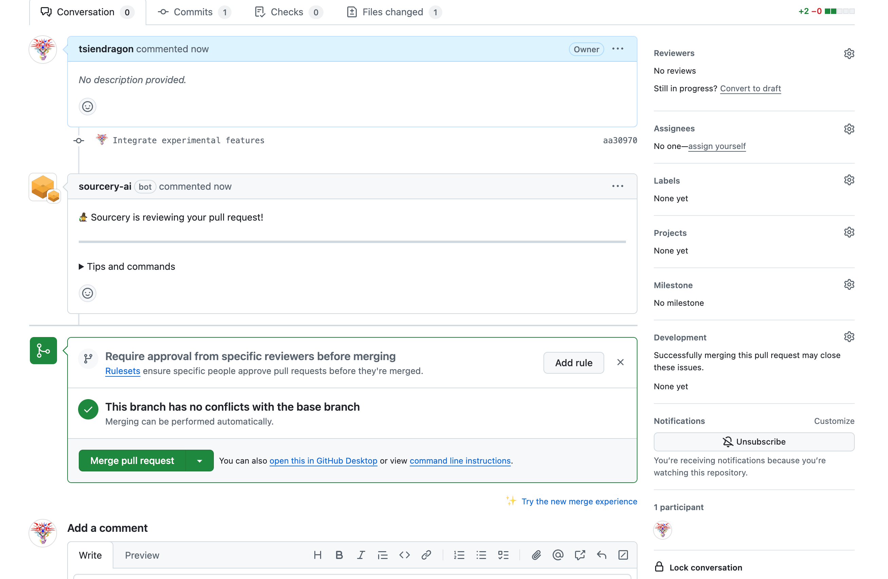

   ```bash
   git checkout main
   git pull  # 再次确保 main 是最新的
   ```

### 2.use git stash to work cross branches

1. 在 `zhangwei/feature/a` 分支上工作时，突然需要切换到 `xiaohong/feature/b` 修复bug：

   ```bash
   git checkout xiaohong/feature/a
   # 在 zhangwei/feature/a 上进行工作
   echo "Feature A work in progress" >> experiment/feature_a.txt
   git add experiment/feature_a.txt

   # 需要切换分支，但工作还未完成，使用 stash 保存
   git stash save "feature A work in progress"

   # 切换到 xiaohong/feature/b 分支
   git checkout xiaohong/feature/b

   # 在 xiaohong/feature/b 上修复 bug
   echo "Bug fix in feature B" >> experiment/feature_b.txt
   git add experiment/feature_b.txt
   git commit -m "Fix bug in feature B"
   ```

2. 现在需要立即提交 `xiaohong/feature/a` 上的工作， 并完成手头 feature/b 的工作

   ```bash
   # xiaohong/feature/b 上的新工作
   echo "New task in feature B" >> experiment/feature_b.txt
   git add experiment/feature_b.txt

   # 保存 xiaohong/feature/b 的工作
   git stash save "feature B new task"

   # 切回 xiaohong/feature/a 并恢复之前的工作
   git checkout xiaohong/feature/a
   git stash list  # 查看所有 stash
   git stash pop stash@{1}  # 恢复最近的 stash（feature A 的工作）
   git status
   >> ...
   >>    modified: experiment/feature_a.txt
   >> ...

   # 完成 xiaohong/feature/a 的工作并提交
   git add experiment/feature_a.txt
   git commit -m "Complete feature A work"
   ```

3. 返回 `xiaohong/feature/b` 继续工作：

   ```bash
   git checkout xiaohong/feature/b
   git stash list
   >>>stash@{0}" On xiaohong/feature/b: feature B new task"
   git stash pop   # 恢复 feature B 的工作
   # changes 里面会出现 experiment/feature_b.txt

   # 完成 xiaohong/feature/b 的工作并提交
   git add experiment/feature_b.txt
   git commit -m "Complete new task in feature B"
   ```

### 3. merge 工作流程

张伟和小红在同一个项目上工作，他们需要分别开发不同的功能。
分别模拟zhangwei 和 xiaohong 的工作流程。他们分别创建不同的分支.

最开始的状态如下：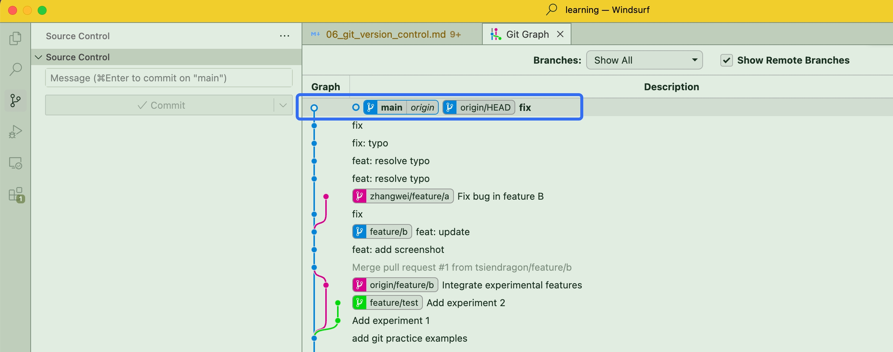

   ```bash
   # 小红：从最新的 main 分支创建功能分支
   git checkout main
   git pull  # 确保 main 是最新的， 一般切换新分支之前，先pull以免落后，导致conflict
   git checkout -b xiaohong/feature/register
   ```

   ```bash
   # 张伟：从最新的 main 分支创建功能分支
   git checkout main
   git pull  # 确保 main 是最新的
   git checkout -b zhangwei/feature/login
   ```

1. 张伟开始开发用户登录功能：


   ```bash
   # 张伟：从最新的 main 分支创建功能分支
   git checkout main
   git pull  # 确保 main 是最新的
   git checkout -b zhangwei/feature/login

   # 张伟：开发登录功能
   echo "登录页面设计" > experiment/login.txt
   git add experiment/login.txt
   git commit -m "Add login page design"

   echo "登录验证" >> experiment/login.txt
   git add experiment/login.txt
   git commit -m "Add login validation"
   ```

   目前状态应该是 zhangwei/feature/login 会提前main 两个提交

   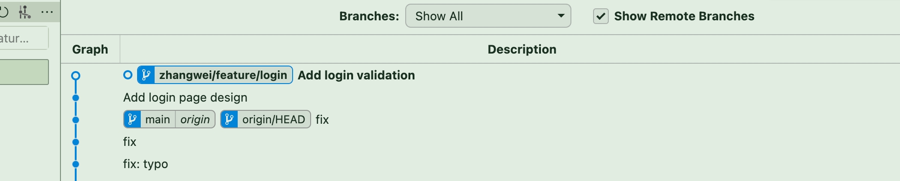

   张伟提交merge request 到 main 并合并。

   ```bash
   # 张伟：提交并合并功能
   git push origin zhangwei/feature/login
   # 创建 merge request
   # 正常是在github 页面提交merge request，进行review 再合并，请查阅第一个例子。下面是直接在命令行合并，模拟这个工作。
   git checkout main
   git pull  # 再次确保 main 是最新的
   git merge zhangwei/feature/login
   git push origin main
   ```

   merge 之后，main 保持和zhangwei/feature/login 同步
   

2. 同时，小红在开发注册功能：

我们假设小红和张伟都在开发注册功能。
切换到小红的分支工作

```bash
git checkout -b xiaohong/feature/register
```

小红独立在自己的分支工作。

   ```bash
   # 小红：开发注册功能
   echo "注册页面设计" > experiment/register.txt
   git add experiment/register.txt
   git commit -m "Add register page design"

   echo "注册验证" >> experiment/register.txt
   git add experiment/register.txt
   git commit -m "Add register validation"

   # 小红也需要在login.txt 上做一个修改，但是她还不知道张伟的修改
   echo "注册后登录验证" >> experiment/login.txt
   git add experiment/login.txt
   git commit -m "Add login validation after register"
   ```
此时的分支状态为

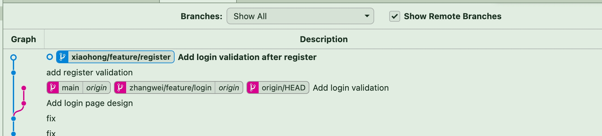

3. 小红提交注册功能：

   ```bash
   # 小红：获取最新的 main 分支并更新自己的功能分支
   git checkout main
   git pull
   git checkout xiaohong/feature/register
   git merge main  # 将最新的 main 合并到自己的功能分支
   ```

   这时可能会出现merge conflict, 因为小红和张伟都在修改register.txt，所以会出现conflict。

   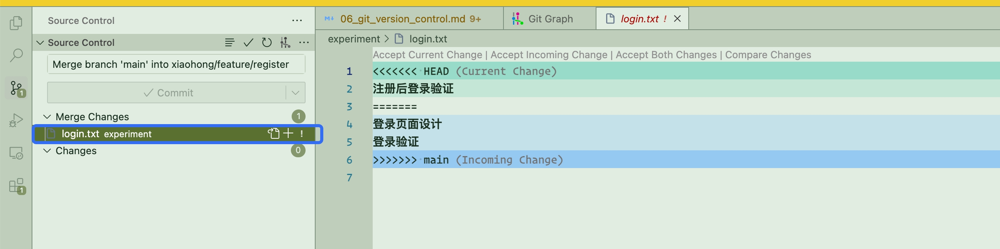
   在source control 中，点击conflict 文件, 查看冲突的内容，在编辑器中解决掉conflict。

   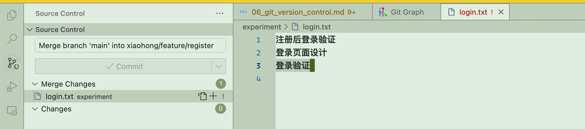

   解决完之后，提交合并的commit

   ```bash
   git commit -m "Merge branch 'main' into 'xiaohong/feature/register'"
   ```

   ```bash
   # 小红：提交并合并功能
   git push origin xiaohong/feature/register
   # 创建 merge request
   git checkout main
   git pull
   git merge xiaohong/feature/register
   git push origin main
   ```
提交完merge request之后，小红的分支和main 保持一致。并且包含了zhangwei 的register功能。

### 4. git cherry-pick

git cherry-pick 用于从一个分支中挑选特定的提交（commit）并应用到当前分支，而不影响其他提交。它适用于以下场景：

跨分支迁移单个或多个提交（如将 feature 分支的某个提交应用到 main）。
修复 Bug（挑选修复 Bug 的 commit，合并到生产环境）。
避免合并整个分支（只想要特定的更改，而不是整个分支的所有提交）。

现在模拟一个例子，让我们看看如何使用 git cherry-pick。

> 张伟在工作是开发登录功能，小红在开发注册功能。张伟发现小红的密码检查函数很实用，想要在登录功能中使用。

准备工作：首先创建并设置两个分支的内容。

**小红的分支**

   ```bash
   # 小红创建新分支
   git checkout main
   git checkout -b xiaohong/feature/4

   # 创建实验目录
   mkdir -p experiment

   # 创建工具文件
   echo "1. 邮箱格式检查函数" > experiment/utils.txt
   git add experiment/utils.txt
   git commit -m "Add email check function"

   echo "2. 密码强度检查函数" >> experiment/utils.txt
   git add experiment/utils.txt
   git commit -m "Add password check function"
   ```

**张伟的分支**

   ```bash
   # 张伟创建新分支
   git checkout main
   git checkout -b zhangwei/feature/4

   # 确保实验目录存在
   mkdir -p experiment

   # 创建登录功能文件
   echo "登录页面设计" > experiment/login.txt
   git add experiment/login.txt
   git commit -m "Add login page design"
   ```
准备好的小红和张伟的分支应该如下

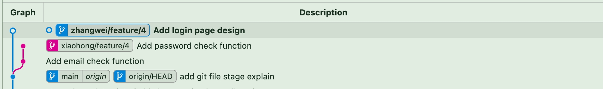


张伟发现小红的密码检查函数很实用，想要在登录功能中使用，但是还不想合并小红的所有提交。。

   ```bash
   # 查看小红分支的提交历史
   git log xiaohong/feature/4
   >>>
   >>> commit d8f6173bec335204dfe18866a05d9fa9af66147d (xiaohong/feature/4)
   >>> Author: lilong <TsienDragon@outlook.com>
   >>> Date:   Thu Jan 30 16:47:38 2025 +0800
   >>>
   >>>   Add password check function
   >>>
   >>> commit 925abd9a8a1f842159d8defb0d721891ef50a221
   >>> Author: lilong <TsienDragon@outlook.com>
   >>> Date:   Thu Jan 30 16:47:05 2025 +0800
   >>>
   >>>   Add email check function
   >>>
   >>> commit f4a078a916e587d40f0368930318571d66e7f96d (origin/main, origin/HEAD, main)

   # 张伟要把小红实现的邮箱验证的功能pick 过来，找到邮箱验证函数的提交 hash

   git checkout zhangwei/feature/4 # 确保在张伟的分支
   git cherry-pick 925abd9a8a1f842159d8defb0d721891ef50a221  # 925abd9a8a1f842159d8defb0d721891ef50a221 是密码检查函数的提交 hash
   # 你可以使用 commit 的前几位（通常 7-10 位即可），只要它在当前仓库中是唯一的
   # 或者用 git cherry-pick 925a

   ```
这样张伟的分支中就把小红的密码检查函数pick 过来了。

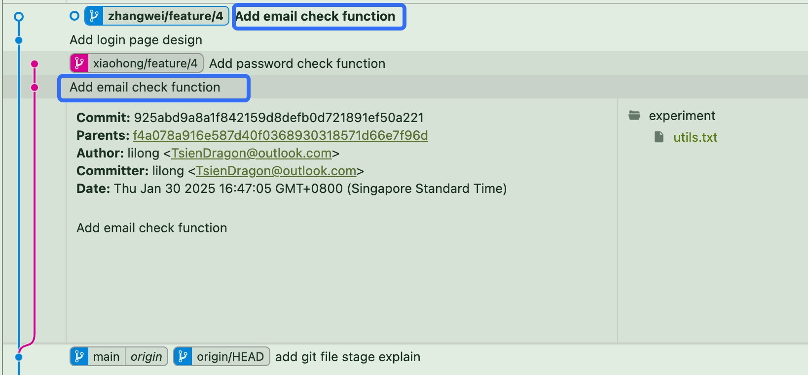

如图所示 这两个commit 的内容一摸一样，但是他们的commit hash是不一样的。

### 5. git rebase
在 Git 版本控制中，git rebase 是一个强大的命令，主要用于整理提交历史，使其更加线性和清晰
准备工作：模拟一个需要进行 rebase 的场景。

本文介绍了 Git Rebase 的典型使用场景，并通过一个 张伟（开发支付功能）与小红（开发用户资料功能）并行开发 的案例，展示了如何使用 git rebase 来整理 Git 历史，使提交记录更清晰和线性。

张伟和小红先同时从当前的main 分支基础上，先独立开发

**张伟开发**

```bash
# 创建并切换到功能分支
git checkout main
git pull
git checkout -b zhangwei/feature/payment

# 在功能分支上进行一些提交
echo "添加支付按钮" > experiment/payment.txt
git add experiment/payment.txt
git commit -m "Add payment button"

echo "添加支付处理函数" >> experiment/payment.txt
git add experiment/payment.txt
git commit -m "Add payment handler"
```

**小红开发**

```bash
# 小红在张伟开发期间，完成了用户资料更新功能
git checkout main
git pull
git checkout -b xiaohong/feature/profile

# 添加用户资料更新功能
echo "添加用户头像上传" > experiment/profile.txt
git add experiment/profile.txt
git commit -m "Add avatar upload"

echo "添加个人信息编辑" >> experiment/profile.txt
git add experiment/profile.txt
git commit -m "Add profile editor"
```

**小红先提交合并到 main**

```bash
git checkout main
git merge xiaohong/feature/profile
git push
```

现在main同步了小红的用户资料更新功能，但是张伟的支付功能还没有同步，所以需要在zhangwei/feature/payment 分支上进行rebase。 如果直接使用merge 会让main 分支出现分叉。如果想保持分支结构为线性，则需要用到rebase。


张伟随后开始使用 rebase 合并到自己的分支

```bash
# 首先更新 main 分支
git checkout main
git pull

# 切回功能分支并执行 rebase
git checkout zhangwei/feature/payment
git rebase main
# 保持了zhangwei 分支和main的线性结构， 再提交merge request

# 如果有冲突，解决后继续
git add .
git rebase --continue
# 因为 rebase 改变了历史，需要强制推送
git push --force-with-lease origin zhangwei/feature/payment
```

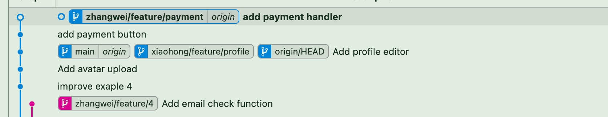

现在zhangwei/feature/payment 分支和main 分支都是线性的了，如上图

登陆github 页面，创建merge request，按下图所示依次执行。
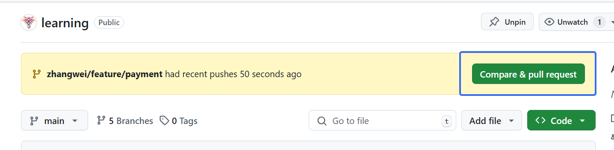

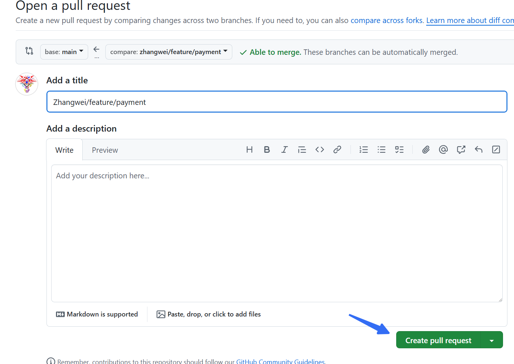

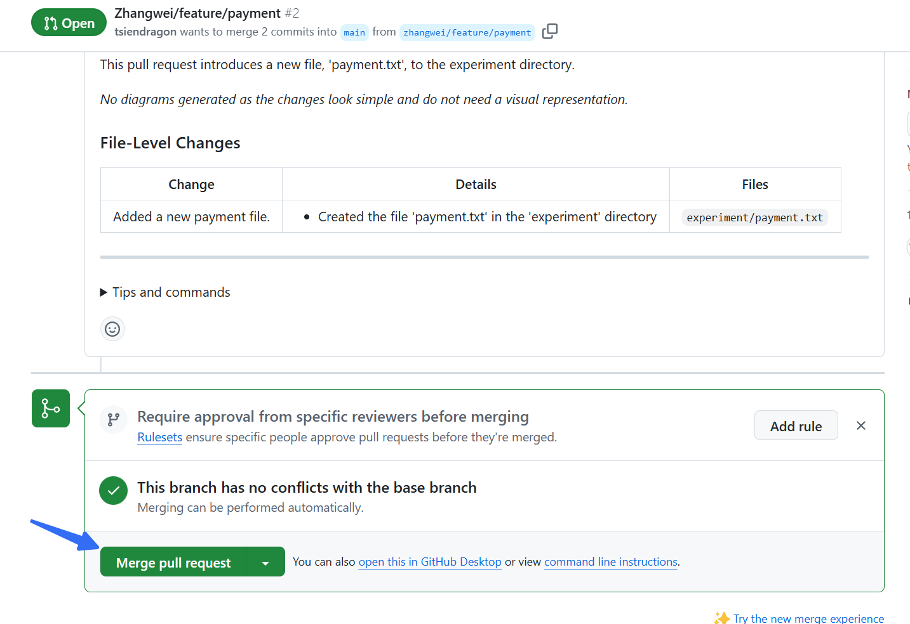
注意需要在merge request 中选择rebase and merge选项
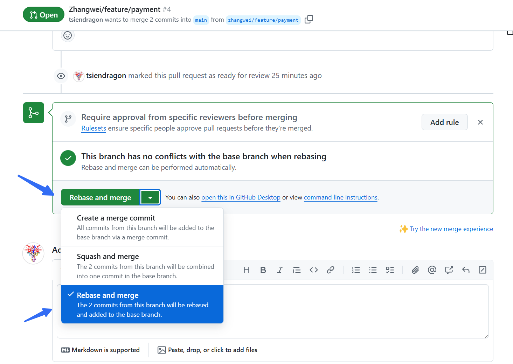
如果是merge 则main 就会出现分叉
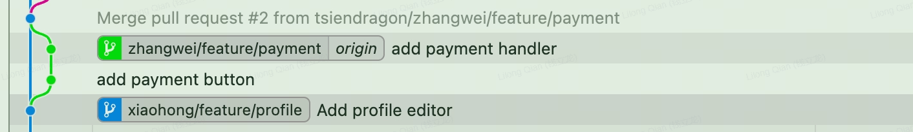

本地同步跟新

```bash
git checkout main
git pull
```
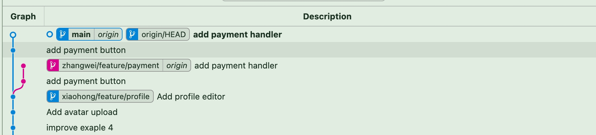

现在main 分支也是线性了 同时同步了zhangwei 分支的更新.

注意事项：

- 不要在公共分支上使用 rebase（比如 main 分支）
- 强制推送要谨慎使用，确保不会影响他人的工作
- 如果遇到复杂的冲突，可以使用 `git rebase --abort` 取消操作
- 建议在 rebase 之前创建一个备份分支：

  ```bash
  git branch zhangwei/feature/payment-backup
  ```

### 6. git reset
一个简单的例子

刚开始的状态
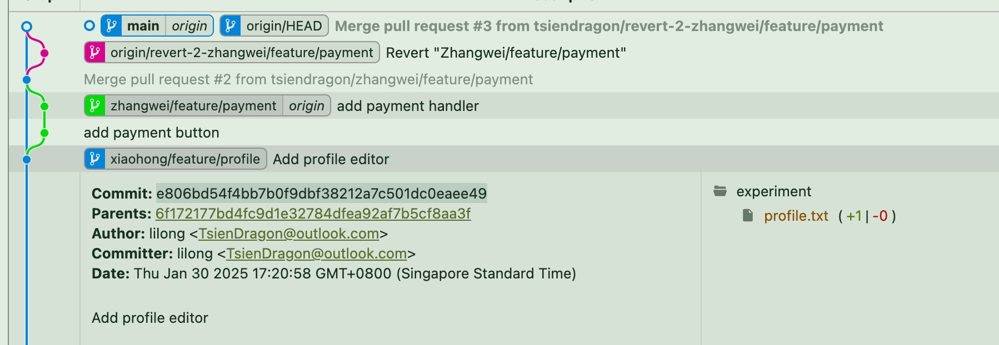

想把main reset 到合并之前的状态

找到合并之前的commit hash

```
git reset --hard e806bd
```
rest之后的状态
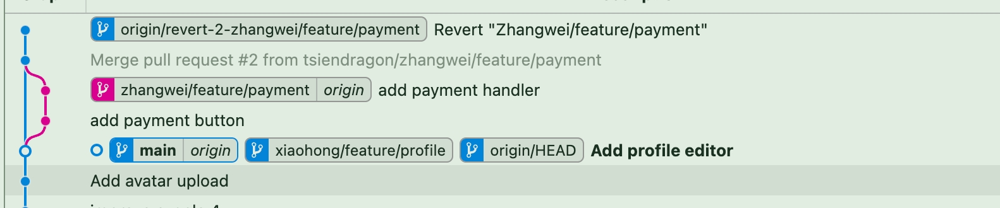

更进一步，`git reset` 有三种模式：

- `--soft`：仅重置 HEAD 到指定提交，保留暂存区和工作目录的更改
- `--mixed`（默认）：重置 HEAD 和暂存区，保留工作目录的更改
- `--hard`：重置 HEAD、暂存区和工作目录，完全回到指定提交的状态

准备工作：创建一个场景来演示不同类型的文件状态。

1. 初始设置：

   ```bash
   # 创建新分支
   git checkout main
   git checkout -b zhangwei/feature/reset-demo

   # 创建实验目录
   mkdir -p experiment

   # 第一个提交：添加项目配置
   echo "login" > experiment/login.txt
   echo "项目配置文件" > experiment/config.txt
   git add experiment/config.txt
   git add experiment/login.txt

   git commit -m "Initial commit: Add config file"

   # 第二个提交：添加用户模块
   echo "用户登录功能" > experiment/user.txt
   git add experiment/user.txt
   git commit -m "Add user login module"

   # 第三个提交：添加订单模块
   echo "订单处理功能" > experiment/order.txt
   git add experiment/order.txt
   git commit -m "Add order processing module"

   # 第四个提交：更新配置
   echo "更新配置参数" >> experiment/config.txt
   git add experiment/config.txt
   git commit -m "Update config settings"

   # 查看提交历史
   git log --oneline
   # 会显示类似：
   # abc1234 Update config settings
   # def5678 Add order processing module
   # ghi9012 Add user login module
   # jkl3456 Initial commit: Add config file
   ```

现在准备演示不同的文件状态：

   ```bash
   # 1. 已暂存的文件
   echo "已暂存的文件" > experiment/staged.txt
   git add experiment/staged.txt

   # 2. 已修改但未暂存的文件
   echo "新的订单功能" >> experiment/order.txt

   # 3. 未跟踪的文件
   echo "未跟踪的文件" > experiment/untracked.txt
   mv experiment/config.txt experiment/configs.txt
   rm experiment/login.txt
   git mv experiment/register.txt experiment/register_func.txt
   ```

2. 查看当前状态：

   ```
   Changes to be committed:
   (use "git restore --staged <file>..." to unstage)
        renamed:    experiment/register.txt -> experiment/register_func.txt
        new file:   experiment/staged.txt

   Changes not staged for commit:
   (use "git add/rm <file>..." to update what will be committed)
   (use "git restore <file>..." to discard changes in working directory)
         deleted:    experiment/config.txt
         deleted:    experiment/login.txt
         modified:   experiment/order.txt

   Untracked files:
   (use "git add <file>..." to include in what will be committed)
         experiment/configs.txt
         experiment/untracked.txt
   ```

   在vscode 的source countrol 中也可以看到各个文件的状态

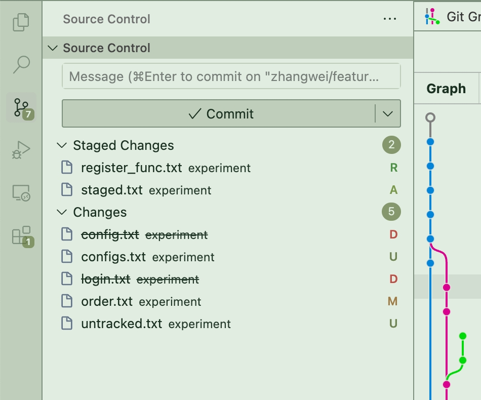

- R 表示renamed
- M 表示modified
- D 表示deleted
- U 表示untracked
- A 表示added

#### 1. 使用 `git reset --soft`：

在 Git 命令 `git reset --soft HEAD~1` 中，`HEAD~1` 的含义如下：
- **`HEAD`** ：指的是当前分支的最新提交（即 `HEAD` 指针指向的提交）。

- **`~1`** ：表示“向上回退 1 次提交”（即 `HEAD` 的上一个提交，也就是 `HEAD^`）。
  - `HEAD~1` 等同于 `HEAD^`，表示回退 1 次提交。

  - `HEAD~2` 表示回退 2 次提交，以此类推。

**例子**

假设你的 Git 提交历史如下：


```css
A -- B -- C (HEAD)
```
执行 `git reset --soft HEAD~1` 后，`HEAD` 会回退到 `B`，但不会修改暂存区（staging area）和工作区（working directory）：

```css
A -- B (HEAD)
```
但 `C` 的更改仍然存在于暂存区，意味着你可以重新提交它或进行其他操作。不同的 `git reset` 选项：
- `--soft`：只回退 `HEAD` 指针，提交的更改仍然在暂存区（`git status` 会显示文件仍处于 "Changes to be committed" 状态）。

- `--mixed`（默认）：回退 `HEAD` 指针，并且撤销 `git add` 的操作，但不会影响工作目录。

- `--hard`：彻底回退提交，并且删除所有代码改动（慎用）。
你可以根据实际需求选择合适的 `git reset` 选项。


```bash
# 软重置到上一个提交
git reset --soft HEAD~1
git status
```

现在的状态
```
Changes to be committed:
  (use "git restore --staged <file>..." to unstage)
        modified:   experiment/config.txt
        renamed:    experiment/register.txt -> experiment/register_func.txt
        new file:   experiment/staged.txt

Changes not staged for commit:
  (use "git add/rm <file>..." to update what will be committed)
  (use "git restore <file>..." to discard changes in working directory)
        deleted:    experiment/config.txt
        deleted:    experiment/login.txt
        modified:   experiment/order.txt

Untracked files:
  (use "git add <file>..." to include in what will be committed)
        experiment/configs.txt
        experiment/untracked.txt
```
Update config settings 的commit 没有了，但是其他的文件状态都没有变化


####  使用 `git reset --mixed`（默认模式）：
先恢复各种文件的状态

```bash
git reset --hard HEAD@{1}
git mv experiment/register.txt experiment/register_func.txt
echo "staged" >> experiment/staged.txt
git add experiment/staged.txt
 echo "change user" >> experiment/user.txt
git add  experiment/user.txt
echo "change order" >> experiment/order.txt
rm experiment/login.txt
```

各种文件的状态
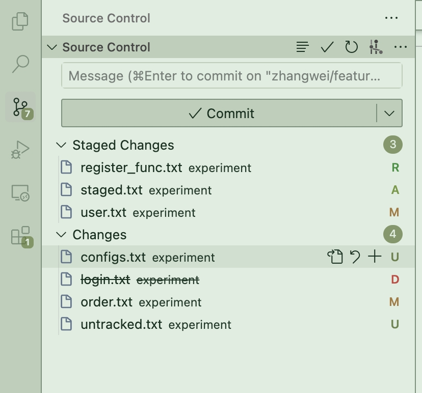

```bash
git reset HEAD~2  # 或 git reset --mixed HEAD~1
git status
>>> Changes not staged for commit:
>>>  (use "git add/rm <file>..." to update what will be committed)
>>>  (use "git restore <file>..." to discard changes in working directory)
>>>        modified:   experiment/config.txt
>>>        deleted:    experiment/login.txt
>>>        deleted:    experiment/register.txt
>>>        modified:   experiment/user.txt

>>> Untracked files:
>>>   (use "git add <file>..." to include in what will be committed)
>>>        experiment/configs.txt
>>>        experiment/order.txt
>>>        experiment/register_func.txt
>>>        experiment/staged.txt
>>>        experiment/untracked.txt
```

清除了staged 修改，但是其他的文件状态没有变化，staged 变成了 untracked或者 un-staged. user.txt 变成了un-staged, 因为user.txt 之前已经track过了。staged.txt 变成了untracked, 因为staged.txt 没有track过。register_func.txt 变成了untracked, 因为register_func.txt 没有track过, 因为register的commit 已经被撤回了，当前的commit 没有track 过register.txt 和register_func.txt，后者是从register.txt 重命名而来。


####  使用 `git reset --hard`

```
git reset @{1} # 回复到前两个commit

```
丢弃所有修改

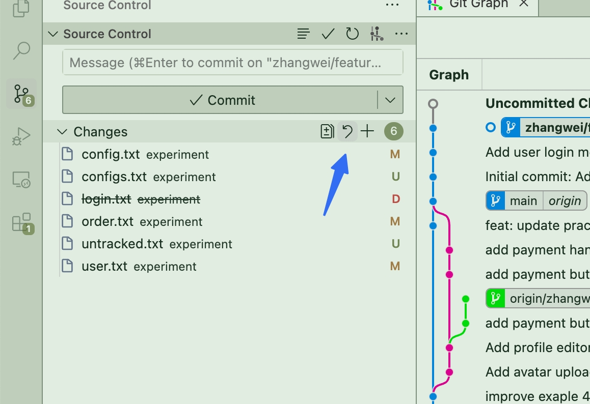

现在所有修改的都没有了
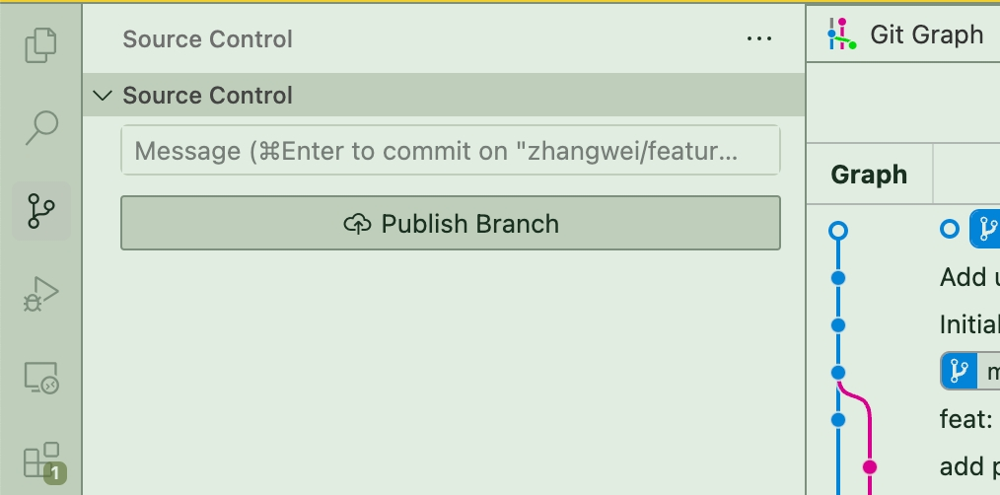

再模拟各种各种文件状态

```bash
git mv experiment/register.txt experiment/register_func.txt
echo "staged" >> experiment/staged.txt
git add experiment/staged.txt
 echo "change user" >> experiment/user.txt
git add  experiment/user.txt
echo "change order" >> experiment/order.txt
rm experiment/login.txt
echo "untracked" >> experiment/untracked.txt
echo "config update 2" >> experiment/config.txt
```

目前的状态

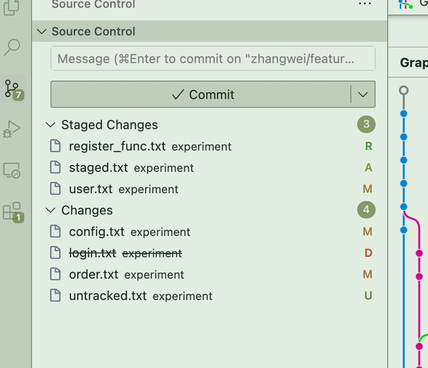


config.txt 内容
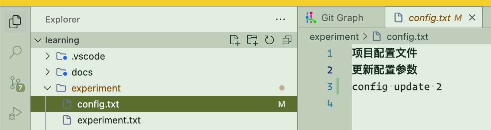


```bash
git reset --hard HEAD~2 # reset 连个commit
```

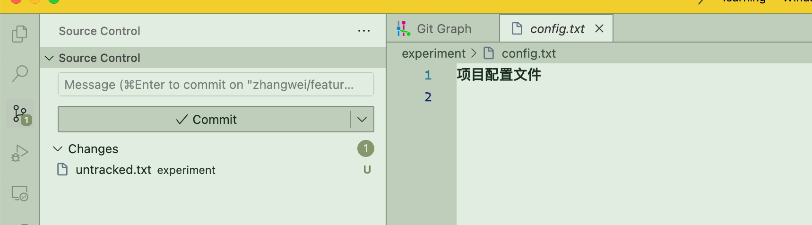

reset 之后只剩下两个commit，同时source control 只剩下untracked.txt


**Git `reset` 命令对不同文件状态的影响**

| 文件状态 | git reset --soft | git reset --mixed | git reset --hard |
| --- | --- | --- | --- |
| HEAD（提交历史） | 回退到指定提交 | 回退到指定提交 | 回退到指定提交 |
| 暂存区（Staging Area） | 不变 | 清除（回到 HEAD 状态） | 清除（回到 HEAD 状态） |
| 工作区（Working Directory） | 不变 | 不变 | 恢复为 HEAD 状态（丢弃已跟踪文件的修改） |
| 已提交的文件（Tracked, Unmodified） | 不变 | 不变 | 不变 |
| 已修改但未提交的文件（Tracked, Modified） | 不变 | 不变 | 丢弃修改，恢复为 HEAD 版本 |
| 已暂存但未提交的文件（Tracked, Staged） | 保持暂存 | 撤回暂存，但保留修改 | 丢弃修改，恢复为 HEAD 版本 |
| 未跟踪的文件（Untracked） | 不变 | 不变 | 不变（不会删除） |
| 忽略的文件（Ignored） | 不变 | 不变 | 不变 |


---

**补充**
- `--soft`：**只回退提交历史** ，暂存区和工作区**保持不变** 。适用于撤销最近的提交但保留代码状态（类似 `git commit --amend`）。

- `--mixed`（默认）：**回退提交历史并清除暂存区** ，但**不影响工作区** 。适用于回退提交但保留代码修改，重新 `git add` 之后可以重新提交。

- `--hard`：**回退提交历史、清除暂存区、重置工作区** ，即**完全恢复到指定提交的状态** ，已修改但未提交的更改会**被丢弃** （**慎用！** ）。


---

**其他相关命令** 如果 `git reset --hard` 之后发现误操作，可以尝试：

```bash
git reflog
git reset --hard HEAD@{1}  # 恢复到 reset 之前的状态
```
如果想**删除未跟踪的文件** ，需手动运行：

```bash
git clean -fd  # 删除未跟踪的文件和目录
git clean -fx  # 删除未跟踪的文件，包括 .gitignore 里忽略的文件
```
这张表可以帮助你选择适合的 `reset` 方式，以避免数据丢失。

注意事项：

- `--hard` 是不可逆的，使用前要确保不需要保留任何更改
- 未跟踪的文件不受 `git reset` 影响
- 如果不确定，可以先创建分支备份：

  ```bash
  git branch backup-before-reset
  ```

- 可以使用 `git reflog` 查看操作历史，在意外重置后恢复：

```bash
git reflog  # 查看操作历史
git reset HEAD@{1}  # 恢复到上一个操作， 可以简写为 git reset @{1}
```

git reset HEAD@{1} 也可以使用 --soft、--mixed 和 --hard 选项，作用与 git reset <commit> 相同，只不过 HEAD@{1} 指的是 Git reflog 记录中的上一个 HEAD 位置

因此在实际开发中，尽量将工作及时commit 和push，避免出现丢失数据的情况。实在要立马操作，不方便commit 的时候，可以用stash 暂存，然后在合适的时候再进行操作